# MIST4610Project1

## Team Name:
15058 Group 7

## Team Members:
1. Tyler Schildkraut [@tylerschildkraut](https://github.com/tylerschildkraut)
2. Angela Ren [@angelaaa456](https://github.com/angelaaa456)
3. Sammy Effron [@seffron](https://github.com/seffron)
4. Audrey Staples [@audreystaples](https://github.com/audreystaples)
5. Tanner Sutherland [@tannersutherland](https://github.com/tannersutherland)

## Problem Description:
We wanted to construct a data model that organizes key information used to navigate the NCAA college football landscape. The ultimate goal for our model is to represent the various relationships that exist among Coaches, Teams, Players, Rosters, Games, etc. in a way that mirrors how real NCAA programs operate. Although our data is hypothetical, it represents pertinent information that would meet managerial requirements within the NCAA ecosystem. From surveying game statistics to determining player status on a roster, our database provides insights that would prove highly useful to NCAA stakeholders. Ultimately, we aimed to create a database that would effectively aid managerial decision making within essential business units such as logistics management, decision-making, and reporting within an ever evolving industry.

## Data Model:
Our database is based on the NCAA with hypothetical data included for ease of data insertion. For instance, instead of the University of Georgia the record is the Athens Bulldogs.

Beginning with the Teams entity, we made teamID our identifier and included attributes such as teamName and conference. This entity relates to our Coaches entity with a one-to-many relationship because Teams have many Coaches, but those Coaches are linked to only one Team. Our Coaches attribute is identified by a coachID and contains attributes such as name, role which describes their specific coaching position (Head Coach, Offensive Coordinator, etc.), yearsOfExperience describing the amount of years of coaching experience they have, as well as a foreign key of teamID. Rosters represent the associative entity connecting the many-to-many relationship between Teams and Players as players can be on many teams and teams are composed of many players. Rosters are identified by rosterID, and they have attributes such as a foreign keys playerID and teamID. Additionally, Rosters display the startDate of a player’s commitment to a team as well as the endDate which could be null if the player is still playing. Rosters also display the player’s position on that specific team as well as their jersey number on that specific team. The Players entity is identified by a unique playerID which is the primary key of that entity. In addition to that, the Players entity has attributes such as name, the player’s yearInSchool, their height in inches, their weight in pounds, and the status of their scholarship, if applicable. Additionally, the Players entity has a one-to-many relationship with the entity named Injuries as players have many injuries but a specific instance of an injury can only occur once in one player. Injuries have the primary key injuryID along with attributes such as injuryName, lengthOfRecovery, surgery name if needed, as well as the foreign key playerID which specifies the one-to-many relationship.

Moving on to another key entity, we have Games. Games are identified by their primary key which is called gameID. Our Teams table has two one-to-many relationships with the Games entity meaning that one instance of a Team (the home team) has many games but those games only have the one home team. Additionally, another instance of a Team (the away team) also has many Games but those specific games are only related to one away team. For that reason, our Games entity contains two foreign keys from the Teams table, one being homeTeamID and the other being awayTeamID. Another foreign key in the Games table is the stadiumID. The last attribute in the Games table is the date attribute which specifies the date the game occurred on. Our Stadiums table represents a one-to-many relationship between Stadiums and Games. Stadiums house many games but those games can only be played at one stadium at a time. Stadiums are also identified by attributes such as stadiumName, city, and capacity. Stadiums also have a one-to-many relationship with Seats because a stadium has many seats but a seat can only be in one stadium. Seats have the primary key seatID as well as attributes like section, row, seatNumber, seatType, and the foreign key stadiumID. Seats also have a one-to-many relationship with Tickets as a seat can be sold by many tickets but tickets only are attached to one seat. Tickets are identified by ticketID, and have attributes such as price, ticketHolderName, the foreign key gameID, and the foreign key seatID. This then brings about the relationship between Games and Tickets being one-to-many as games have many tickets but a specific ticket is only attached to one game. The last entity that needs describing is our Statistics entity. Statistics has a many-to-one relationship with Players as Players have many statistics but a specific statistic is only connected to one player. Another relationship that exists with Statistics is a many-to-one relationship with Games. Statistics are present in many games, but a game only has one instance of a specific player statistic. Statistics are identified by a statID, a foreign key of playerID, yards if applicable, touchdowns if applicable, tackles if applicable, interceptions if applicable, receptions if applicable, fieldGoals if applicable, as well as the foreign key gameID.

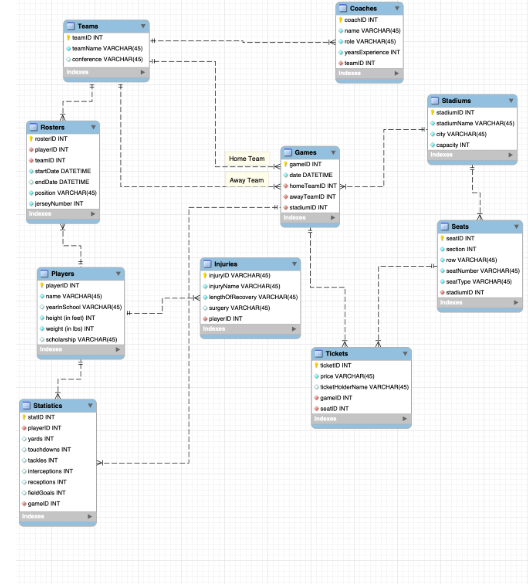

## Data Dictionary:
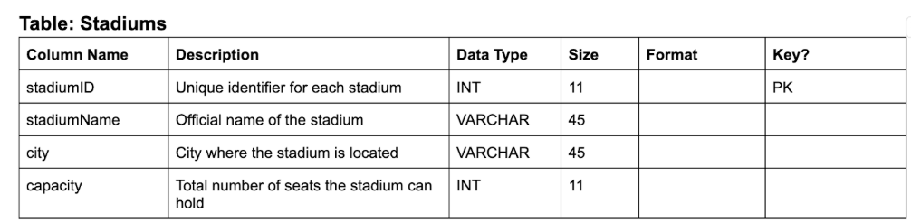

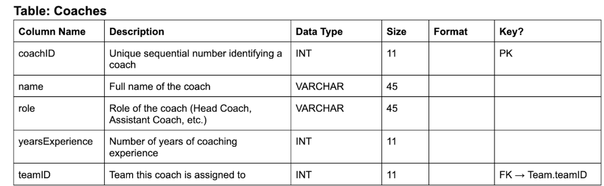

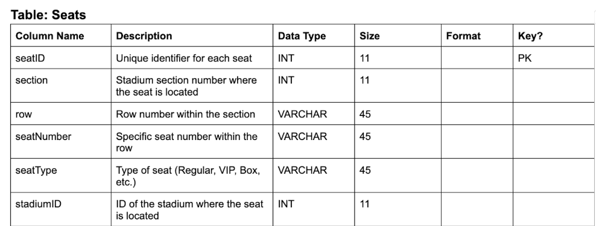

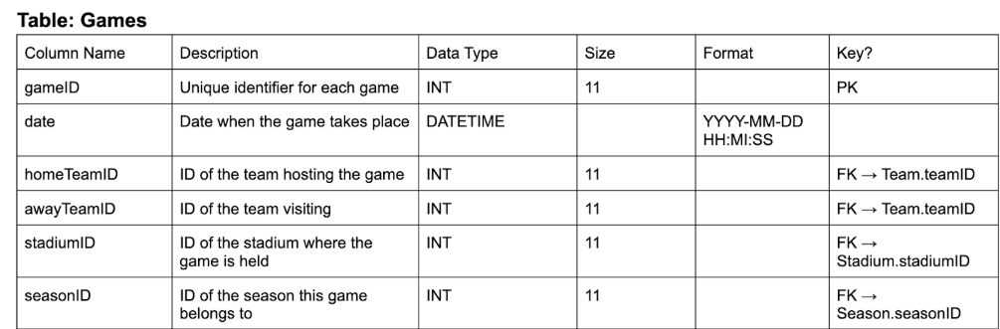

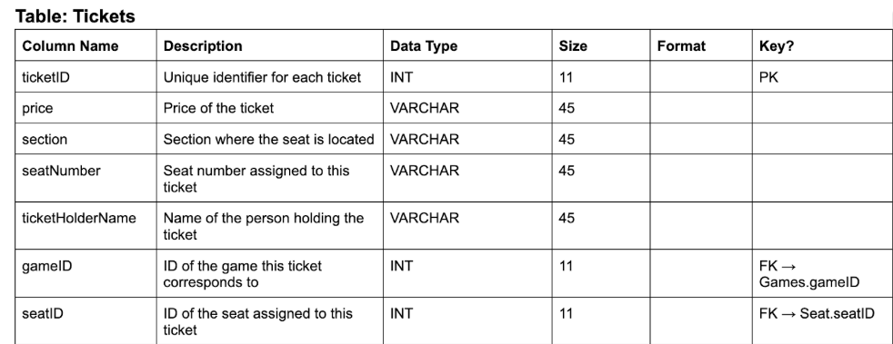

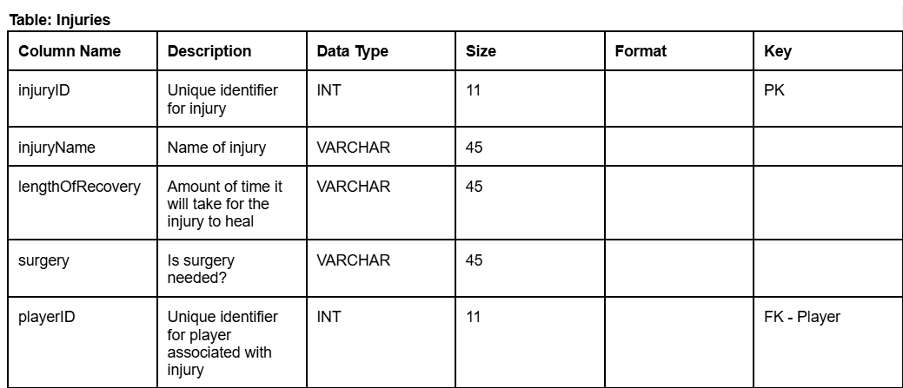

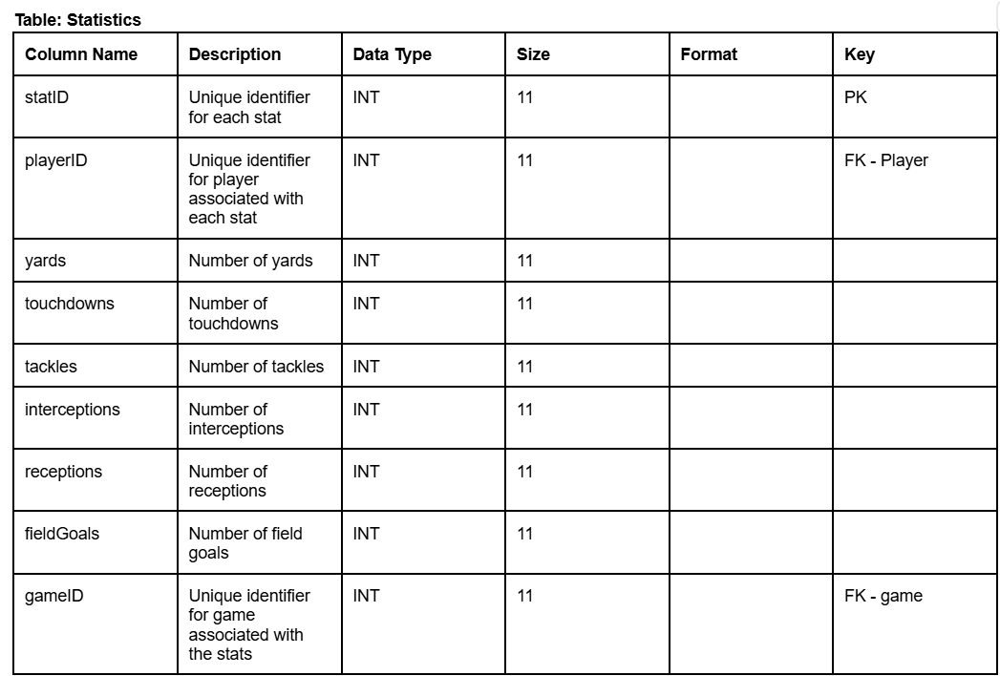

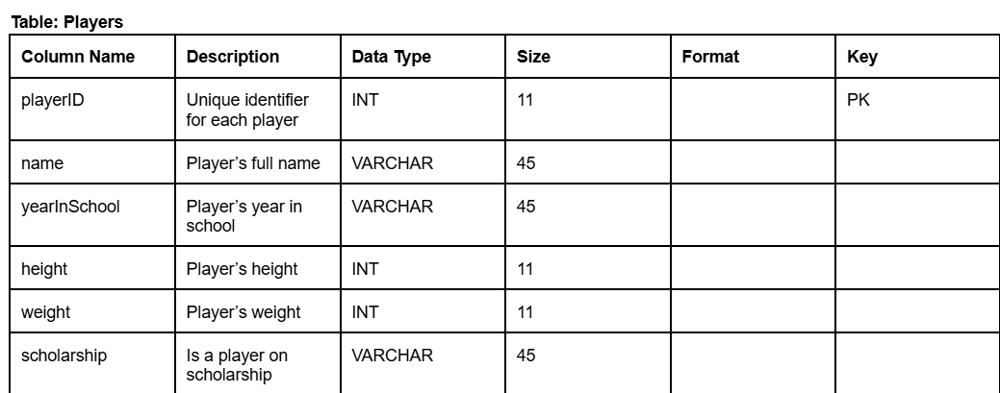

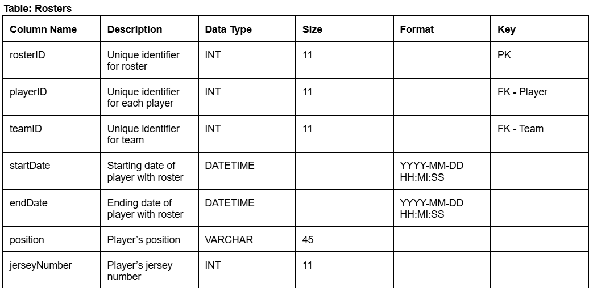

## Queries:
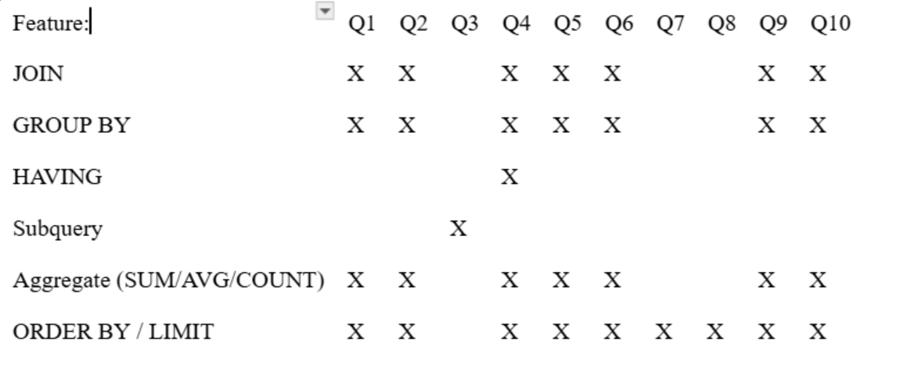

Query 1: Number of Players on Each Team

Description: This query shows every team and counts how many players are currently listed on their roster. It joins the Teams and Rosters tables using the teamID to associate players with their teams, then groups the results by each team name.

Justification: Roster size directly affects scholarship budgeting, recruiting needs, and practice planning. Athletic departments can use this information to verify roster compliance with NCAA limits (e.g., 85 scholarship players in Division I football) and identify whether certain teams are under- or over-staffed. It also provides insights for coaching staff to balance positional depth across the roster.

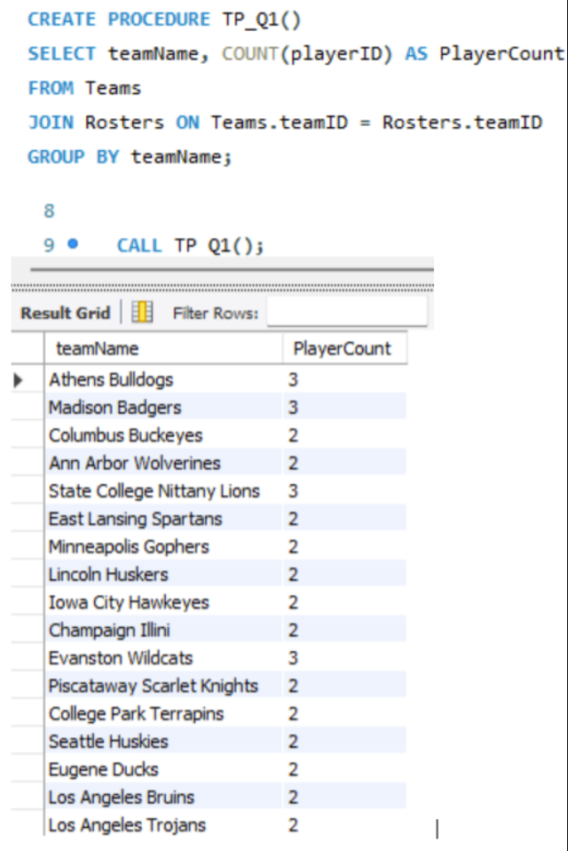

Query 2: Total Yards per Player

Description: Calculates the total number of offensive yards gained by each player across all games using the Statistics table. The query groups by player name and sums their yards column, returning players in descending order of total yardage.

Justification: Tracking cumulative yardage helps offensive coordinators evaluate player impact and consistency. This data is key for determining award nominations, highlighting top performers in media relations, and identifying players who may deserve more playing time or position adjustments based on productivity.

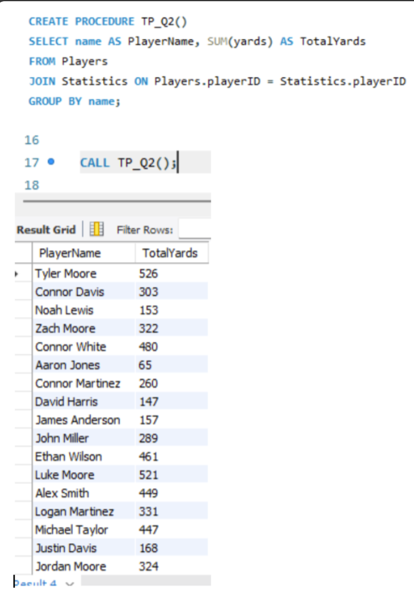

Query 3: Players Without Recorded Statistics

Description: Identifies all players who have not yet recorded any game statistics by checking which player IDs are not present in the Statistics table.

Justification: This helps coaching staff and analysts find players who have not appeared in any games and make decisions about those players accordingly. Managers can use this information to determine which players may need more opportunities to play or to address what to do with those players in the future.

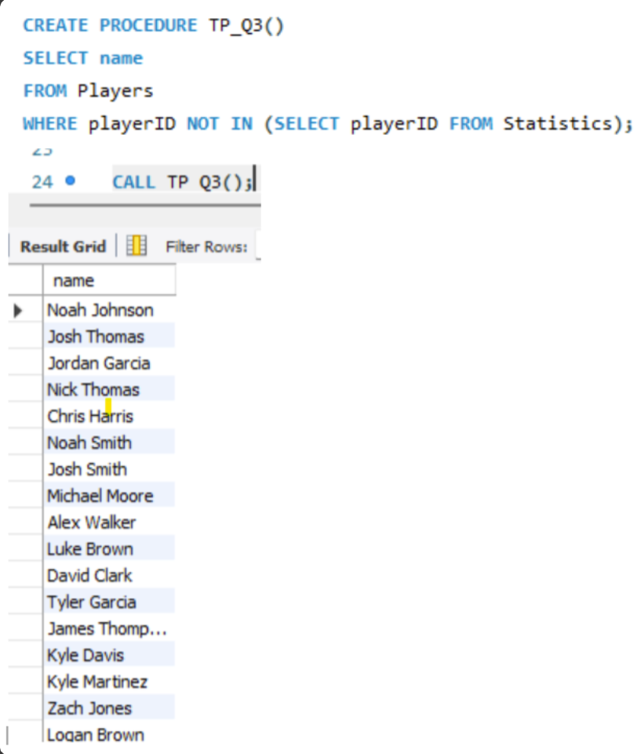

Query 4: Players with Multiple Recorded Injuries

Description: Displays all players who have sustained more than one recorded injury. It joins Players and Injuries using playerID, groups the results by player, and filters using a HAVING clause.

Justification: Identifying players with frequent injuries allows medical staff to implement personalized recovery or training programs. Coaches can use this information to manage playing time and avoid re-injury, which reduces long-term risk and protects the team’s investment in scholarship athletes.

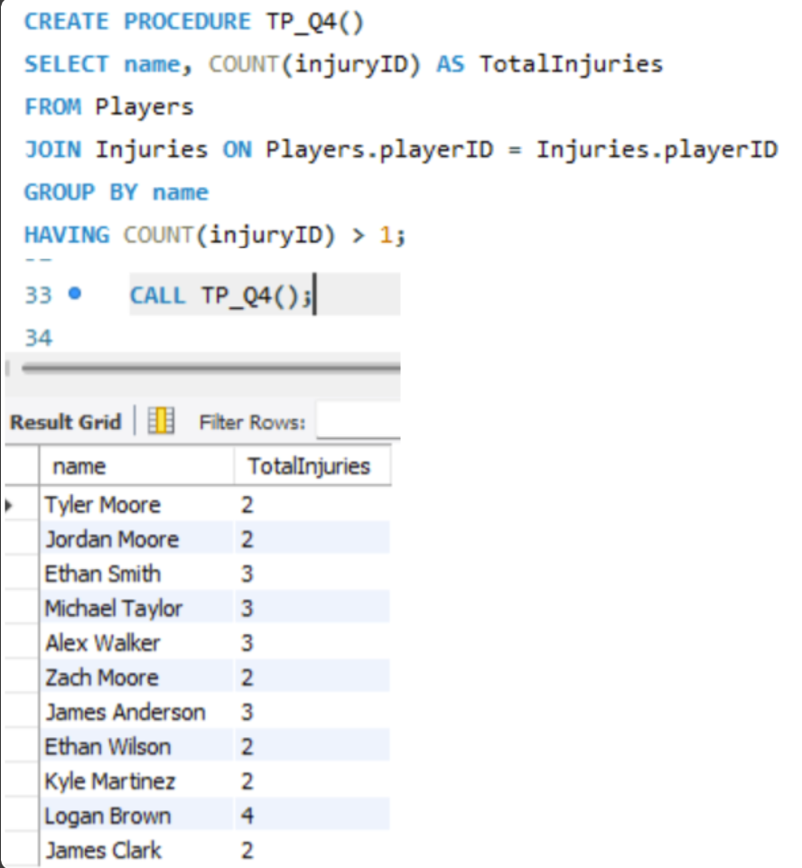

Query 5: Average Player Weight by Position

Description: Finds the average weight of players for each position across all rosters. It joins Rosters and Players and groups the results by position.

Justification: Weight and conditioning benchmarks are crucial for maintaining competitiveness. This data helps strength and conditioning coaches monitor whether players at each position (e.g., linemen, receivers, linebackers) meet desired physical standards and make training adjustments if a position group is under or over target weight ranges.

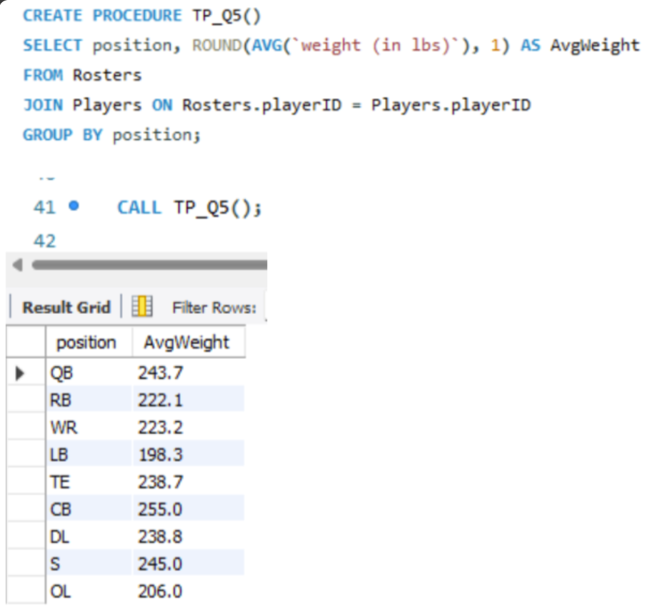

Query 6: Total Games Played by Each Team

Description: Shows the number of total games each team has participated in—both home and away. It joins Teams and Games and counts how many times a team appears as either the home or away team.

Justification: Tracking total games played helps administrators measure team activity levels across the season and can highlight scheduling imbalances. Operations teams can use this data to evaluate travel frequency, ensure scheduling fairness, and make logistical improvements for future seasons.

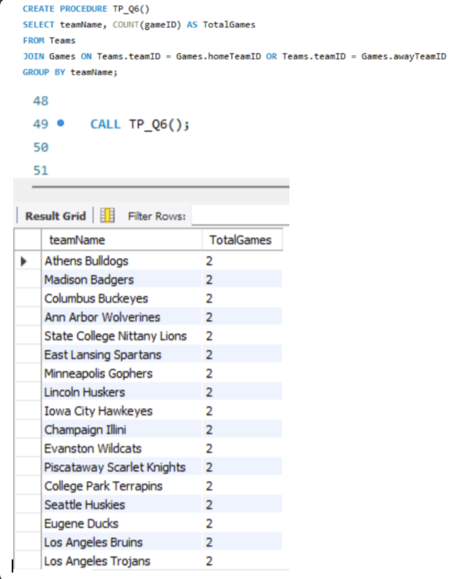

Query 7: Current Scholarship Players

Description: Lists all players who currently receive full athletic scholarships, ordered alphabetically by name.

Justification: Scholarship allocation is one of the largest financial responsibilities for athletic programs. This query helps compliance officers ensure that scholarship funds are properly assigned and enables administrators to monitor financial obligations and renewal cycles.

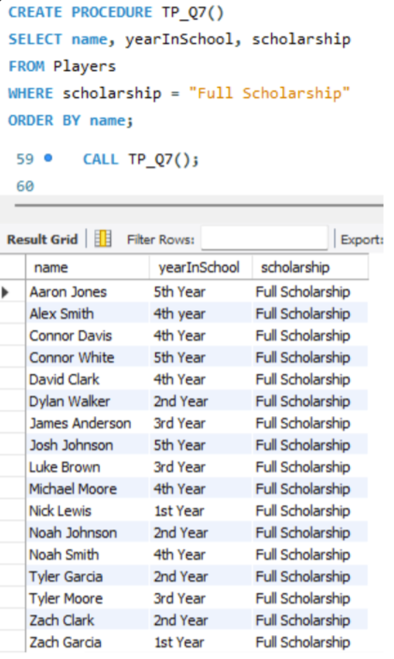

Query 8: Longest Recovery Injuries

Description: Displays the injuries in the database with the longest reported recovery times, ordered from longest to shortest.

Justification: Provides insight into which types of injuries are most severe and time-consuming to heal. This allows sports medicine staff to plan future prevention programs, identify potential insurance or cost implications, and communicate expected recovery timelines to coaches and media. Although we had not yet learned this feature, we utilized AI to accomplish this query as the VARCHAR() data format is not compatible with the ORDER BY DESC or ASC capabilities. Utilizing CAST and UNSIGNED, our string data values were converted to numbers effectively.

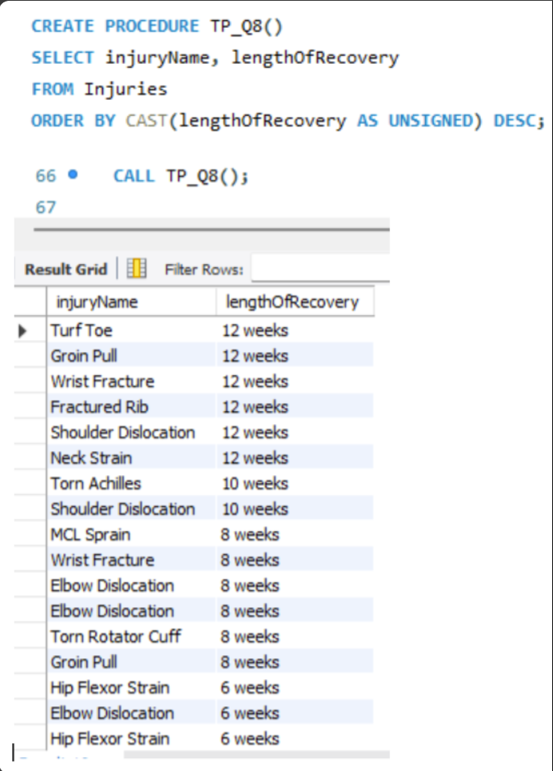

Query 9: Average Ticket Price per Game

Description: Calculates the average price of tickets sold for each game by joining the Games and Tickets tables and grouping results by gameID.

Justification: Understanding average ticket prices helps the marketing and sales department assess revenue potential per game. It also reveals which matchups draw higher-paying audiences, allowing pricing strategies to be adjusted for rivalry or high-demand games to maximize profits. Similarly as before, we utilized the CAST function so that we could convert the original VARCHAR value of the price attribute in the Tickets entity to DECIMAL data formats so that we would be able to perform aggregations on the values.

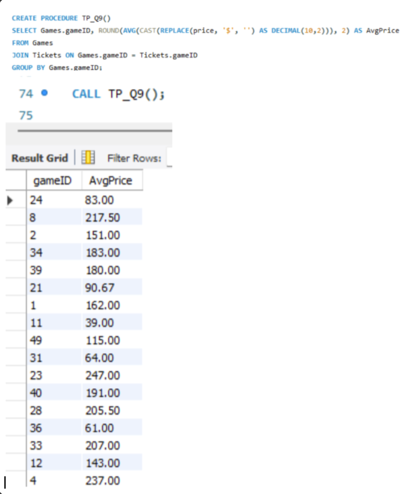

Query 10: Top 5 Players by Touchdowns Scored

Description: Lists the five players with the highest total touchdowns recorded across all games.

Justification: This helps highlight standout offensive players for performance evaluations, awards, and media recognition. Teams can also use this information for recruiting promotions and identifying which athletes consistently contribute to scoring.

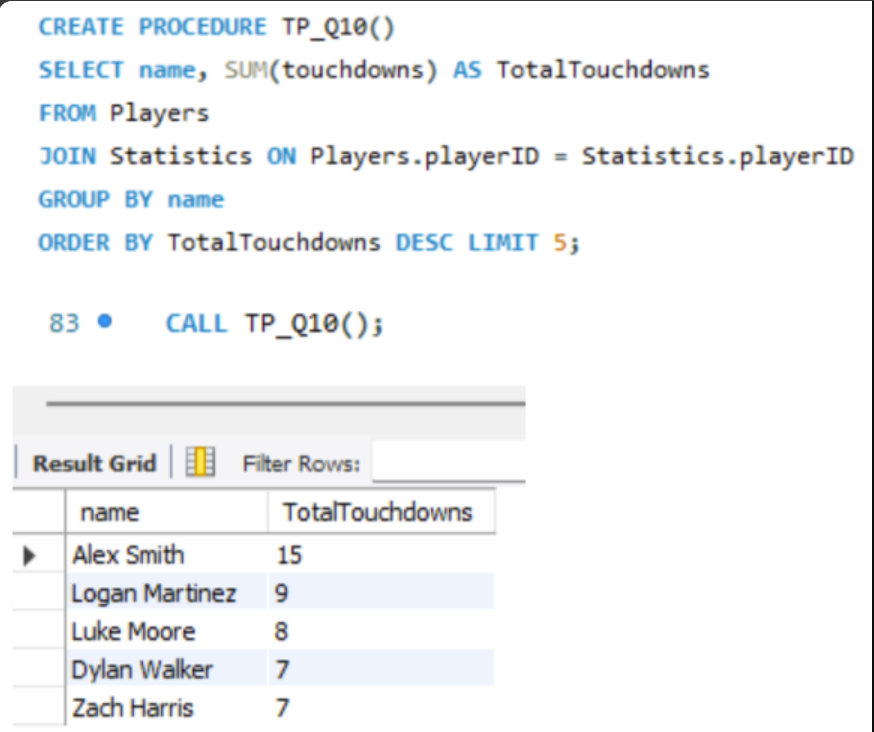

## Database Information:
Name of database: ns_Group7

Additional information: Each query listed above is marked in the database using stored procedures which can be called using the following format: CALL TP_Q1();
# MIST-4610-Project-Group-7

